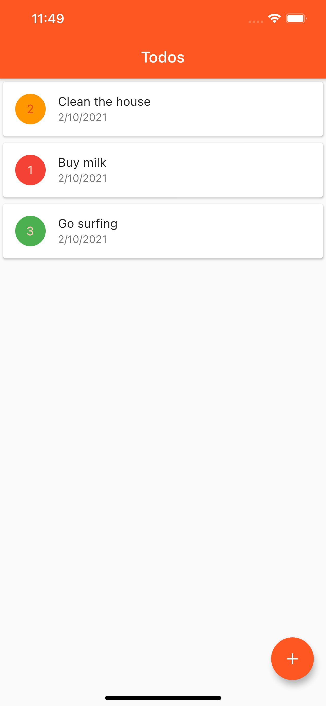
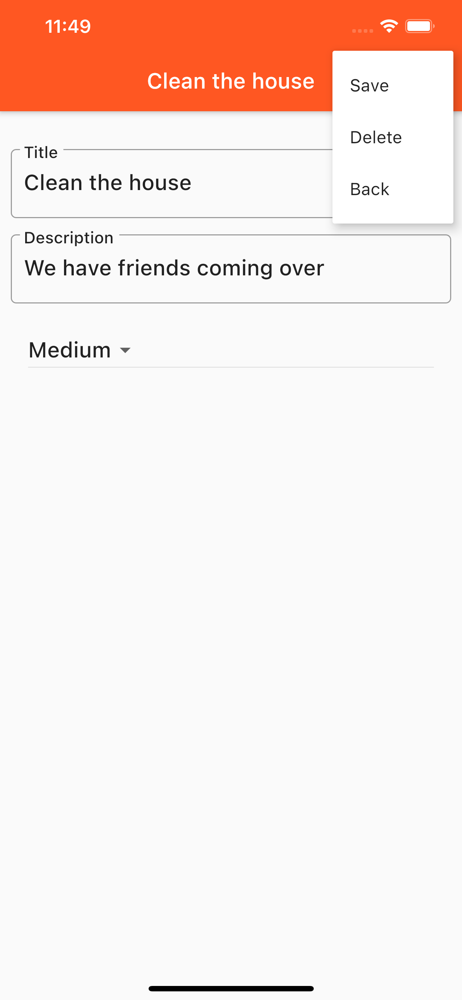

# todo_app

A Todo List App.

## Getting Started

this is a simple todo list app built following the PluralSight course: https://app.pluralsight.com/library/courses/flutter-getting-started/table-of-contents

The app uses Firebase Firestore to store the data.

